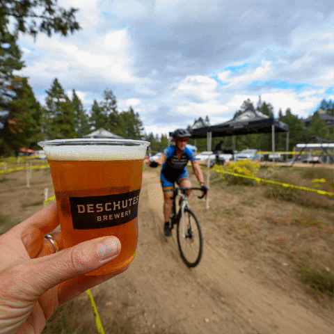
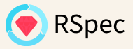

<h1 align="center">Bīk-n-Brü</h1>
<div align="center"></div>
<br>
  
This repo is the Front End portion of the Bīk-n-Brü project built by Mod 3 students at [Turing School of Software and Design](https://turing.edu/). <br>
The purpose of this project is to encourage people to ride their bikes to bars to decrease their carbon footprint by gamifying the exercise/bar experience. 

Visit our [Bīk-n-Brü Website](https://bik-n-bru.herokuapp.com/)! Hosted on Heroku!
<br>

Also check out the *[Bīk-n-Brü Back End GitHub Repo](https://github.com/Bik-n-Bru/BE-Bik-n-Bru)*
<br>

# Table of Contents
- [Learning Goals](#learning-goals)
- [Planning Documents](#planning-documents)
- [Tech & Tools Used](#tech-and-tools)
- [How to Set Up](#how-to-set-up)
- [How to Run Test Suite](#how-to-run-test-suite)
- [Contributors](#contributors)
    
# Learning Goals

- Continue to gain competency with Ruby on Rails Fundamentals
- Use Bootstrap to create a user-friendly experience
- Implementing OAuth log-in feature
- Consuming API's for user and activity information, to store in the back-end Application
- Planning and excecuting web application from idea to conception
- Testing asynchronous front-end API calls to OAuth provider and back-end application to external API's


# Planning Documents

- [Wireframes](https://www.figma.com/file/hjW32yDb6WSBuInlizzRw9/Welcome?node-id=0%3A1&t=LYBwunAfTTKQwib7-0)
- [Project Spec](https://backend.turing.edu/module3/projects/consultancy/)


# Tech and Tools
#### Gems Used:
  - [Pry](https://github.com/pry/pry-rails)
  - [Faraday](https://lostisland.github.io/faraday/)
  - [Orderly](https://github.com/jmondo/orderly)
  - [Capybara](https://github.com/teamcapybara/capybara)
  - [Figaro](https://github.com/laserlemon/figaro)
  - [Webmock](https://github.com/bblimke/webmock)
  - [VCR](https://github.com/vcr/vcr)
  - [Launchy](https://github.com/copiousfreetime/launchy)
  - [RSpec](https://github.com/rspec/rspec-metagem)
  - [Simple-Cov](https://github.com/simplecov-ruby/simplecov)
  - [Factory Bot for Rails](https://github.com/thoughtbot/factory_bot_rails)
  - [Faker](https://github.com/faker-ruby/faker)
  - [Shoulda Matchers](https://github.com/thoughtbot/shoulda-matchers)
  - [Bootstrap](https://github.com/twbs/bootstrap) 

#### Built With
  -  **2.7.4**
  -  **5.2.8.1**
  -  **3.12.0**
  - 
  - 
  - 

# Developer Setup
<ol>
  <li>Fork and clone this repository</li>
  <li>cd into the root directory</li>
  <li>Run <code>bundle install</code></li>
  <li>Run <code>bundle exec figaro install</code></li>
  <li>Run rails <code>db:{create,migrate}</code></li>
  <li>To run this server, run <code>rails s</code> in your terminal</li>
  <li>To stop the local server, use command <code>Control + c</code></li>
  <li>
  
  [Sign up to use the Strava API](https://developers.strava.com/docs/getting-started/#account)

  In config > application.yml

  ```
     strava_client_id: <client_id>
     strava_client_secret: <client_secret>
  ```
 


</ol>

# How to Run Test Suite
  After set up:
  <ol>
    <li>Run <code>bundle exec rspec spec</code></li>
  </ol>

### Project Team:
# Contributors

<table>
  <tr>
    <td></td>
    <td></td>
    <td></td>
    <td></td>
    <td></td>
  </tr>
  <tr>
    <td><strong>Amanda Ross</strong></td>
    <td><strong>Yuji Kosakowski</strong></td>
    <td><strong>Rich Kaht</strong></td>
    <td><strong>Gabe Nuñez</strong></td>
    <td><strong>Annie Pulzone</strong></td>
  </tr>
  <tr>
    <td>
      <div align="center"><a href="https://github.com/amikaross">GitHub</a><br>
      <a href="https://www.linkedin.com/in/amanda-ross-2a62093a/">LinkedIn</a></div>
    </td>
    <td>
      <div align="center"><a href="https://github.com/Yuji3000">GitHub</a><br>
      <a href="https://www.linkedin.com/in/yujikosa/">LinkedIn</a></div>
    </td>
    <td>
      <div align="center"><a href="https://github.com/Freeing3092">GitHub</a></div>
    </td>
    <td>
      <div align="center"><a href="https://github.com/MisterJackpots">GitHub</a><br>
      <a href="https://www.linkedin.com/in/gabriel-c-nunez/">LinkedIn</a></div>
    </td>
    <td>
      <div align="center"><a href="https://github.com/ajpulzone">GitHub </a><br>
      <a href="https://www.linkedin.com/in/annie-pulzone/">LinkedIn</a></div>
    </td>
  </tr>
</table>

### Project Manager:
<table>
  <tr>
    <td></td>
  </tr>
  <tr>
    <td><strong>Mike Dao</strong></td>
  </tr>
  <tr>
    <td>
      <div align="center"><a href="https://https://github.com/mikedao">GitHub</a><br>
      <a href="https://www.linkedin.com/in/michaeldao/">LinkedIn</a></div>
    </td>
  </tr>
</table>